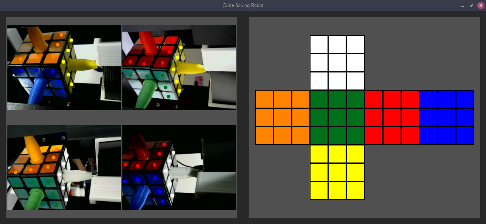

# cube-solving-robot
A personal project involving building a robot that solves the rubik's cube puzzle. There are three major components to this project. There are the robot parts themselves, the arduino code that controls the motion of the robot, and the desktop application that is used to control the robot and solve the puzzles. The application software and additional arduino libraries are written in c++. There are also a few utilities that I have included to make certain tasks more automatic.

# Dependencies:
The arduino itself is only dependent on the arduino libraries included with the default IDE. 

The desktop application requires the following additional libraries:
[OpenCV](https://opencv.org/), [SFML](https://www.sfml-dev.org/), and [ckociemba](https://github.com/muodov/kociemba), a fast implementation of the two phase algorithm for solving rubik's cube puzzles.

# Utilities

The utilities that I have included to make tasks easier are the Sampling helper (compiled with make sampling-config.exe) and the Mask Viewer (compiled with make training-mask.exe).

## Sampling Helper
This file is meant to be run with an image captured from the webcam you are attempting to pinpoint sampling centers from. The inteded usage is to create a file that can be read on startup with the locations of points that are relevant to the scanning of the cube. For example: If you run the main desktop application, and press ctrl + s, the application will save the captured frame from the wecam to a file called "sample.jpg". Then if you wanted to create a locations file called "sampling-locations.dat" you could simply run the command: "./sampling-config.exe sample_flu.jpg > sampling-locations-flu.dat". Then when the image appears, click on the points that you wish to be sampling locations, and then close the window.

## Mask Viewer
The current implementation of the software uses opencv to select ranges of pixels defined by HSV value bounds in "Camera.h" for each of the colors on the cube. Opencv iterates through the image once for each color and generates a binary matrix of pixels with value 0 everywhere any given pixel is outside of the bounds for the speicifed color. Then it uses the sampling centers to count the number of pixels in range inside each circle defined by the center and a radius that match each color. The software then counts the number of matches for each color and whichever is highest is determined as the color for that point. This utility allows you to see the masks for a given sample image, and then reveals what it would conclude given the current bounds. Example usage is: ./training-mask.exe [image_file] [sampling locations].
